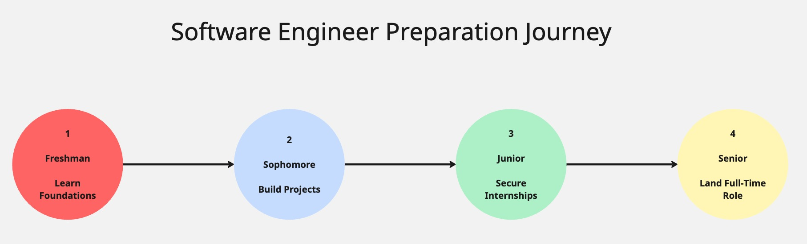

# Graduation Learning Plan: Things to do to Land Your First Software Engineering Job

**Prepared by:** Krish Marpuri  
**Prepared for:** Husky Student pursuing a career in Software Engineering  
**Date:** January 21, 2026

---

## Table of Contents

- [Purpose](#purpose)
- [Building Your Project Portfolio](#building-your-project-portfolio)
- [Preparing for Technical Interviews](#preparing-for-technical-interviews)
- [Securing Internship Experience](#securing-internship-experience)
- [References](#references)

---

## Purpose

As someone interested in Software Engineering, you face significant competition. Hundreds of candidates compete for the same internships and entry roles, which means you must differentiate yourself so employers pick you over others. This Graduation Learning Plan helps you go above and beyond other candidates in creating projects, prepare for interviews, and find ways to land an internship before you're done with college. 

---

## Building Your Project Portfolio

Projects show real life applications of subjects learned in class. UWB Career Services reported that recruiters spend on average 6 seconds looking at a resume, showing why your projects and experiences must stand out from the rest of the crowd[^1]. Projects not only make you appear qualified for a position, but also provide concrete talking points during interviews. Just having your GPA doesn't help them understand that you're able to solve problems, so making some projects is quite beneficial.

Build at least 3 projects that show proficiency for different skills. Some examples include but aren't limited to: A full-stack web project that uses something such as React.js as it is currently the most in-demand framework, a data-based project that use APIs, such as Spotify's API, to gather and analyze existing data and a project that uses lower-level languages, such as C++ to make something that uses data structures. Host all projects on GitHub so recruiters can view your code. Some ways for companies to see you would be to contribute to open-source projects, so you have work that is actively being used in the real world. 

---

## Preparing for Technical Interviews

Software engineering interviews are significantly different from other fields as they require months of prep before even attempting to go to an interview yourself, compared to the generic last-minute studying you are used to. While what you learn in college lets you take your time to solve questions, these interviews test how well you perform under pressure, which is difficult to do without any training whatsoever. Companies test you with a live coding exercise, system design questions and how you are in workspace with others.

In your junior to senior year, dedicate around 5-10 hours a week to prepping for interviews. Data structures and algorithms is easiest studied through LeetCode style questions with websites such as NeetCode as it shows which types of questions are required to pass an interview[^2]. System design is key to understand how companies run their software, so that is something to research about through engineering blogs from companies such as Netflix. Being able to be articulate about what you created in your projects is something that can either make or break an interview, so using websites such as Pramp to do mock interviews to make sure you're ready for the interview[^3].

---

## Securing Internship Experience

Internships provide experience that you can't get through just learning theory, as experience is achieved by doing some real world work. Another reason for why internships are very important is because a lot of companies use internships to gauge potential full-time employees at their company. This makes internships prime opportunities to secure a job before even graduating, or to convince other companies that you know how to work in a job environment.

Finish internship applications in the previous summer of the summer you want the internship as top companies tend to start the hiring and confirmations around December to January of the coming year. Easiest way to increase your chances of getting selected for a second round is to mass apply as with the number of applications that companies get, even if you have a very special application, they might not see it at all, so  apply to every application that is available. The best way to find these types of internships would be to go to the SimplifyJobs GitHub repo for Summer Internships[^4]. Easiest way to get referred for an internship is to go to hackathons and tech meetings to meet people that could help recommend you if they like how you think. Put keywords in your resume to pass the screening system to get selected for a second round interview.Figure 1 shows how each year helps reach this goal.

#### Figure 1: Each Year Builds on the Last to Prepare for a Software Engineering Career

---

*[Word Count: 675]*

---

## References

[^1]: UW Bothell Career Services, "Resume Writing Guide," UWB Career Services, 2025. [Online]. Available: https://www.uwb.edu/careers. [Accessed Jan. 21, 2026].

[^2]: "Neetcode Roadmap," Neetcode.io. [Online]. Available: https://neetcode.io/roadmap. [Accessed Jan. 21, 2026].

[^3]: "Pramp DSA Mock Interview," Pramp.com. [Online]. Available: https://www.pramp.com/dev/uc-data-structures-and-algorithms. [Accessed Jan. 21, 2026].

[^4]: "SimplifyJobs Summer 2026 Internships," GitHub.com. [Online]. Available: https://github.com/SimplifyJobs/Summer2026-Internships. [Accessed Jan. 21, 2026].

